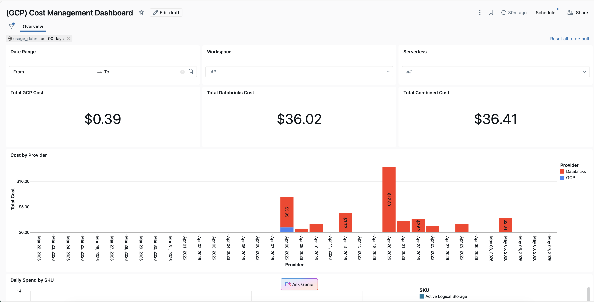
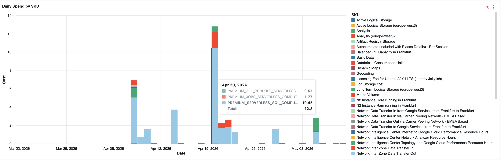

# GCP Unified Cost

The 'GCP Unified Cost' project's purpose is to help enable customers to get a full TCO of their GCP + Databricks cost. This then allows for using Databricks native tooling to process, visualize, and augment the GCP infrastructure cost data with data in Databricks System Tables.

A Databricks Asset Bundle that ingests GCP billing exports and joins them with Databricks DBU usage to produce a unified cost view — broken down by source, job, and SKU.

This is then visualised in a customisable Databricks Dashboard.







**Pipeline architecture:** GCS (Parquet) → Bronze (Auto Loader) → Silver (GCP billing + Databricks usage) → Gold (unified costs)

---

## Prerequisites

### 1. GCP Billing Export
1. Make sure a [Google Cloud Storage bucket](https://docs.cloud.google.com/storage/docs/creating-buckets) is already created and available to host the GCP billing data export.
2. In GCP Console, go to **Billing → Billing export → Standard usage cost** and enable export to a BigQuery dataset. (See the detailed steps [here](https://docs.cloud.google.com/billing/docs/how-to/export-data-bigquery-setup)).
3. Schedule a recurring BigQuery export to a GCS bucket in Parquet format:
   - In BigQuery, open the billing dataset and run an [export query](https://docs.cloud.google.com/bigquery/docs/exporting-data), or use a [scheduled query](https://docs.cloud.google.com/bigquery/docs/scheduling-queries) to export to GCS.
   - Target path: `gs://<your-bucket>/` (Parquet format).

### 2. GCS Access from Databricks
1. In your Databricks workspace, create a [Storage Credential](https://docs.databricks.com/gcp/en/connect/unity-catalog/cloud-storage/external-locations-gcs#generate-a-google-cloud-service-account-using-catalog-explorer)  using that service account:
   **Catalog Explorer → External Data → Credentials → Add credential**
   Name it `gcp-billing-cred`.  
2. When you create the storage credential in Databricks, a service account is automatically created for you. Configure the following [permissions](https://docs.databricks.com/gcp/en/connect/unity-catalog/cloud-storage/external-locations-gcs#configure-permissions-for-the-service-account) on the service account.
3. Run `src/00_create_external_location.sql` once in your workspace to register the GCS bucket as an external location.

---

## Configure Variables

Update `databricks.yml` with your values before deploying:

| Variable | Where | What to set |
|---|---|---|
| `workspace.host` | `targets.dev` / `targets.prod` | Your Databricks workspace URL |
| `source_file_path` | `variables` | GCS bucket path, e.g. `gs://my-billing-bucket` |
| `catalog` | `targets.dev` / `targets.prod` | Unity Catalog catalog name |
| `schema` | `targets.dev` / `targets.prod` | Schema name, e.g. `dev` or `prod` |
| `warehouse_id.lookup.warehouse` | `variables` | Name of a SQL warehouse in your workspace |

---

## Deploy

```bash
# Authenticate
databricks configure

# Deploy to dev (default)
databricks bundle deploy

# Deploy to prod
databricks bundle deploy --target prod

# Run the pipeline
databricks bundle run gcp_cost_management_pipeline
```

---

